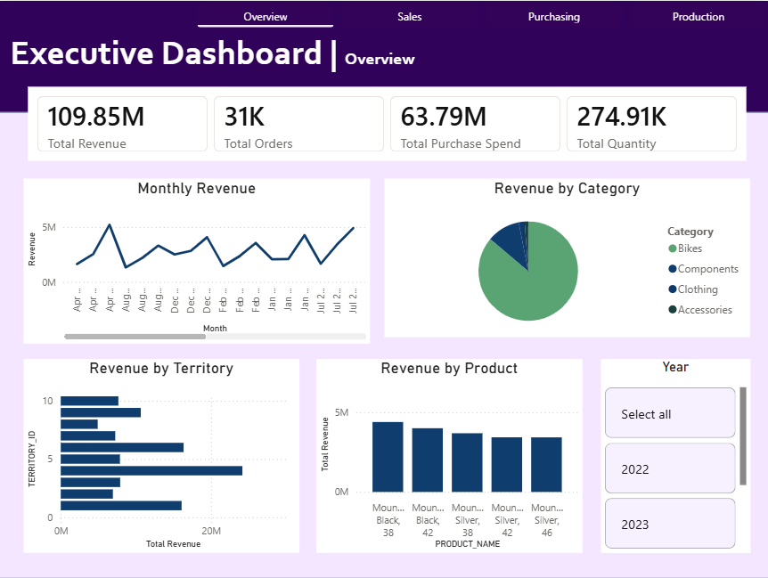
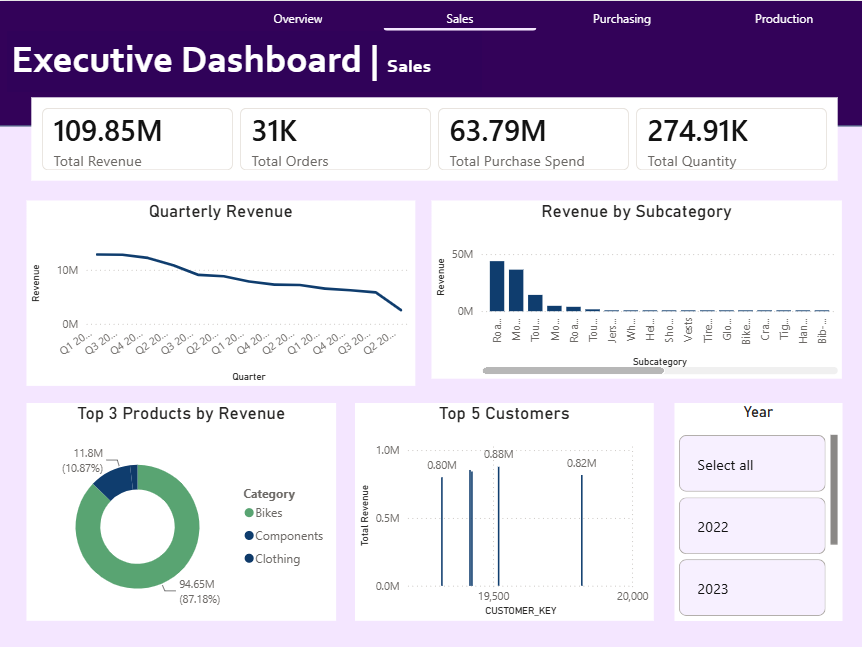
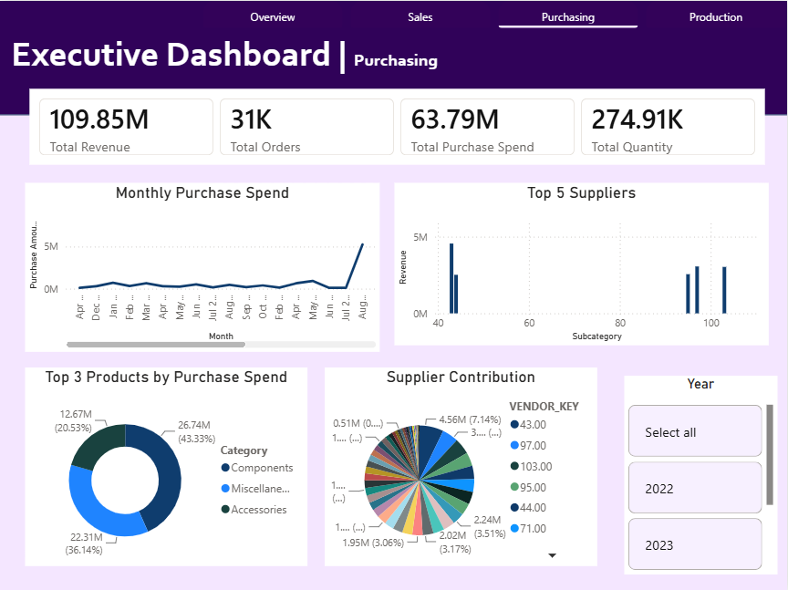
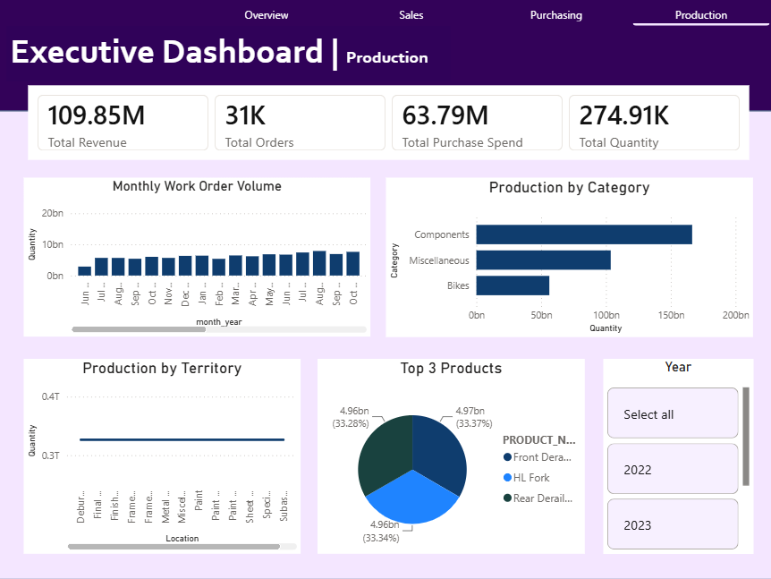

# AdventureWorks ERP Data Warehouse

## Overview

An end-to-end ERP data engineering project using the Microsoft AdventureWorks database.

**Aim:** Design a dimensional data warehouse integrating sales, procurement, inventory, product, vendor, and production data.

**Source:** [AdventureWorks Database by Microsoft](https://github.com/diablo010/adventureworks-database)

## Architecture

```text
AdventureWorks ERP Database
          ↓
   Cloud File Storage
          ↓
      Snowflake
          ↓
   Bronze / Raw Layer
          ↓
     Silver Layer
          ↓
 Dimensional Data Warehouse
          ↓
    Analytics / SQL
```

## Project 1 — ERP → Cloud → Snowflake DWH

### Scope

* Loaded **14 ERP tables** from:

  * Production
  * Purchasing
  * Sales
* Implemented cloud-based ingestion into Snowflake.
* Created Bronze and Silver layers.
* Built dimensional models using fact and dimension tables.
* Added SQL-based analytics on top of the warehouse.
* Connected the Snowflake dimensional warehouse to Power BI for visualization.

### Data Domains

| Domain     | Purpose                               |
| ---------- | ------------------------------------- |
| Sales      | Orders, customers, sales transactions |
| Purchasing | Vendors and purchase transactions     |
| Production | Products and manufacturing data       |
| Inventory  | Stock and product availability        |

## Warehouse Layers

### Bronze

Raw ERP data loaded into Snowflake with minimal transformation.

### Silver

Cleaned and standardized tables with:

* Correct data types
* Null handling
* Data validation
* Consistent naming

### Gold

Dimensional warehouse containing:

* Fact tables for business transactions
* Dimension tables for customers, products, vendors, dates, and other business entities
* Analytics-ready structures

## Analytics

SQL queries are used to answer business questions such as:

Sales
* Monthly revenue and order count
* Top 10 products by revenue
* Top customers by revenue
* Revenue by product category
* Revenue by territory
* Month-over-month revenue growth
* Top 3 products within each category

Purchasing
* Monthly purchase spend
* Top suppliers by purchase spend
* Purchase spend by product category
* Products with highest purchase cost
* Supplier contribution to total purchase spend

Production
* Monthly work-order volume
* Production quantity by product
* Production quantity by location
* Average work-order duration
* Products with highest production volume

Cross-domain
* Revenue vs purchase cost by product
* Gross profit and margin by product
* Products with high sales but low production
* Products with high production but low sales
* Revenue, purchase spend and production volume by month

## Power BI Dashboard

The Snowflake Gold layer is connected to Power BI to create an interactive ERP analytics dashboard.


| Executive Overview | Sales Analysis |
|---|---|
| [](#executive-overview) | [](#sales-analysis) |

| Purchasing Analysis | Production Analysis |
|---|---|
| [](#purchasing-analysis) | [](#production-analysis) |

## Tech Stack

* **Database:** PostgreSQL / AdventureWorks
* **Cloud:** Microsoft Azure
* **Data Warehouse:** Snowflake
* **Ingestion:** Snowpipe
* **Transformation:** SQL
* **Modeling:** Dimensional Modeling
* **Visualization**: Power BI
* **Version Control:** Git / GitHub

## Project Outcome

A cloud-based dimensional ERP data warehouse in Snowflake, transforming operational AdventureWorks data into structured, analytics-ready fact and dimension tables for sales, procurement, inventory, product, vendor, and production analysis, with Power BI dashboards for business reporting.